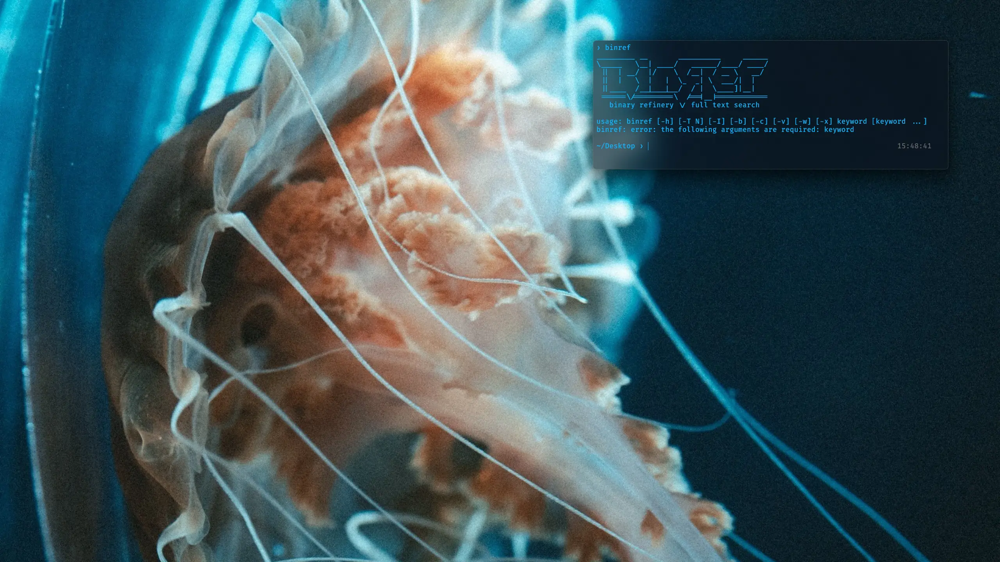
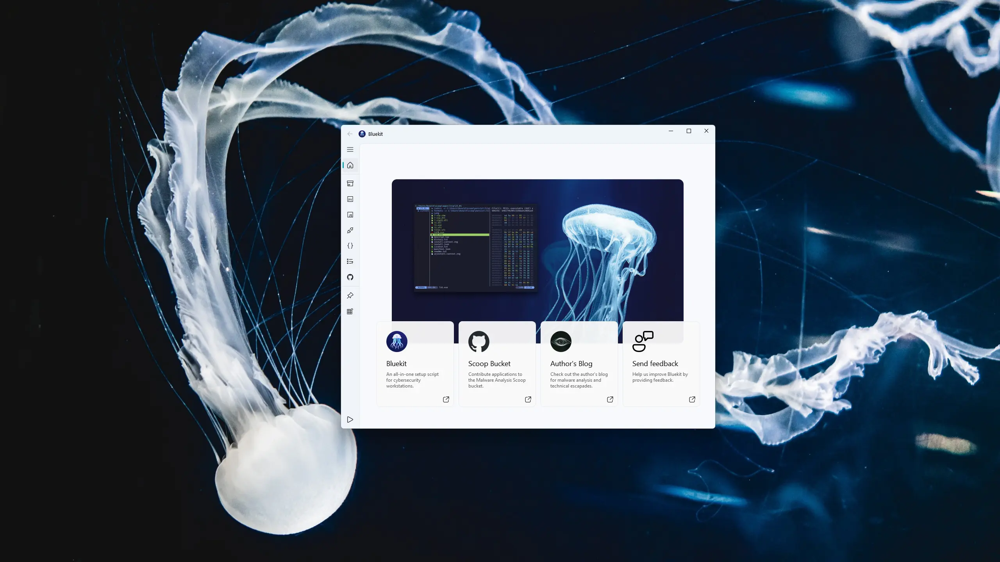

# Bluekit

Bluekit is a cybersecurity-focused workstation setup script that aims to provide a well-rounded and complete analysis environment. 

Bluekit is centered around the [Scoop](https://scoop.sh/) package manager and is complemented by the [Malware Analysis bucket](https://github.com/Donaldduck8/malware-analysis-bucket).

The full list of tools is available [here](https://github.com/Donaldduck8/bluekit/blob/master/data.py).

<p align="center">
  
</p>

## Requirements

> [!CAUTION]
> Bluekit should not be installed on a physical machine. It is designed to run on a clean virtual machine.

* Windows 10 / 11
* PowerShell > 5.1
* Disk capacity > 30 GB
* Memory > 2GB
* Internet connection
* Windows Defender disabled or removed

> [!IMPORTANT]
> It is strongly recommended to create a Windows ISO with Defender removed, rather than attempting to disable Defender on a running Windows installation.
>
> If you must disable Windows Defender after installation, [here](https://lazyadmin.nl/win-11/turn-off-windows-defender-windows-11-permanently/) is a guide to achieve permanent results.

## Installer

<p align="center">
  
</p>

> [!TIP]
> Bluekit provides a GUI-based installer that allows for rudimentary edits of the configuration, as well as visually responsive progress updates.

<p align="center">
  
</p>

## Usage

Bluekit supports the following command-line arguments:

- `--silent`: Execute the installer without a GUI.
- `--config <path>`: Provide the installer with a custom configuration.
- `--keep-cache`: Do not delete Scoop cache files.

## Bundled Files

Bluekit supports bundling files alongside the installer in a file named `bluekit_bundled.zip`. In order to install applications that cannot be provided through a Scoop bucket, a bundle can be constructed like so:

```
╭──────────────────────╮                  ╭───────────────────────────────────╮
│• bluekit.exe         │         ╭────────┤• x64dbg#2024─04─11_18─47[...].zip │
╰──────────────────────╯         │        ╰───────────────────────────────────╯
╭──────────────────────╮         │        ╭───────────────────────────────────╮
│• bluekit_bundled.zip │         ├────────┤• sysinternals#2024.2.13[...].zip  │
╰─●────────────────────╯         │        ╰───────────────────────────────────╯
  │   ╭──────────────────────╮   │                                             
  ├───│• ida_pro.zip         │   │                         ...                 
  │   ╰──────────────────────╯   │                                             
  │   ╭──────────────────────╮   │                                             
  ├───│• ida_pro.json        │   │                                             
  │   ╰──────────────────────╯   │                                             
  │   ╭──────────────────────╮   │                                             
  ╰───│• scoop_cache.zip     ●───╯                                             
      ╰──────────────────────╯                                                 
```

### Licensed Applications

Licensed / non-free applications are configured through `<app_name>.json` entries in the Bluekit configuration. Be sure to include a valid Scoop manifest `.json` file alongside a `.zip` file of the same name containing your licensed application. For example, a manifest for IDA Pro would look like this:

```
{
    "version": "static",
    "description": "A multi-processor disassembler, debugger and decompiler",
    "homepage": "https://hex-rays.com/ida-pro/",
    "license": "Proprietary",
    "url": "file://this/path/will/be/replaced/by/bluekit",
    "hash": "this-hash-will-be-replaced-by-bluekit",
    "bin": [
        ["ida64.exe", "ida64"],
        ["ida.exe", "ida32"]
    ],
    "shortcuts": [
        [
            "ida64.exe",
            "IDA Pro (x64)"
        ],
        [
            "ida.exe",
            "IDA Pro (x86)"
        ]
    ]
}
```

It's recommended to pair licensed applications with an alternative free application as part of a `one_of` entry inside your configuration. This way, other people are still able to use the same configuration, even if they don't own a copy of the licensed application:

```
{
    "type": "one_of",
    "main": [
        "binary_ninja.json",
        "Binary Ninja",
        "A reverse engineering platform."
    ],
    "alternative": [
        "binary_ninja_free",
        "Binary Ninja Free",
        "A free version of Binary Ninja."
    ]
}
```

### Cache

In order to accelerate multiple installations of Bluekit, you can provide a file named ``scoop_cache.zip`` as part of the bundle. This file will allow Scoop to avoid downloading the same programs repeatedly. 

This file can be created by installing Bluekit with the `--keep-cache` argument (or enabling the corresponding option in the settings) and zipping up the contents of the `%USERPROFILE%\scoop\cache` folder after installation.

## FAQ

> [!NOTE]
> My terminal is missing the Windows bar and I can't move / close it!

When using the default configuration, Windows Terminal is launched in Focus mode. You can press `Ctrl+Shift+P` to open the command palette and search for "Toggle focus mode" to disable it.

Alternatively, you could start GlazeWM and explore a tiling windows manager! ChrisTitusTech has a nice introduction to GlazeWM on [Youtube](https://www.youtube.com/watch?v=0I8HyVMKEeo).


## Contributing

You can improve Bluekit by suggesting or adding new manifests to the Malware Analysis bucket! 💙

## Credits

Jellyfish photography by [@Yuki910828](https://twitter.com/Yuki910828), [@aquarium_sora](https://twitter.com/aquarium_sora) and [@haskap1017](https://twitter.com/haskap1017). 📷
