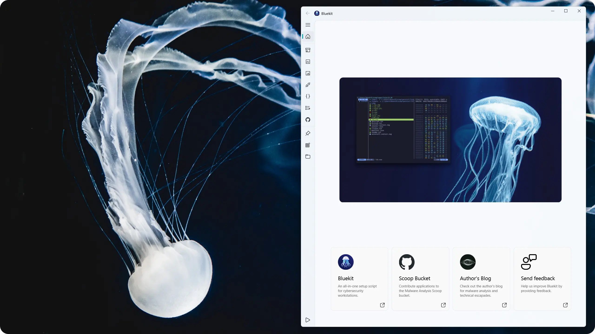

# Bluekit

Bluekit is a cybersecurity-focused workstation setup script that aims to provide a well-rounded and complete analysis environment. 

Bluekit is centered around the [Scoop](https://scoop.sh/) package manager and is complemented by the [Malware Analysis bucket](https://github.com/Donaldduck8/malware-analysis-bucket).

  

## Requirements

> [!CAUTION]
> Bluekit should not be installed on a physical machine. It is designed to run on a clean virtual machine.

* Windows 10 / 11
* PowerShell (64-bit and 32-bit)
* Disk capacity > 40 GB
* Memory > 2GB
* Internet connection

> [!IMPORTANT]
> It's strongly recommended to create a Windows ISO with Defender removed, rather than disabling Defender through intended means.

## Installer

  

> [!TIP]
> Bluekit provides a GUI-based installer that allows for rudimentary edits of the configuration, as well as visually responsive progress updates.

  

## Contributing

You can improve Bluekit by suggesting or adding new manifests to the Malware Analysis bucket! 💙

## Credits

Jellyfish photography by [@Yuki910828](https://twitter.com/Yuki910828), [@aquarium_sora](https://twitter.com/aquarium_sora) and [@haskap1017](https://twitter.com/haskap1017). 📷
