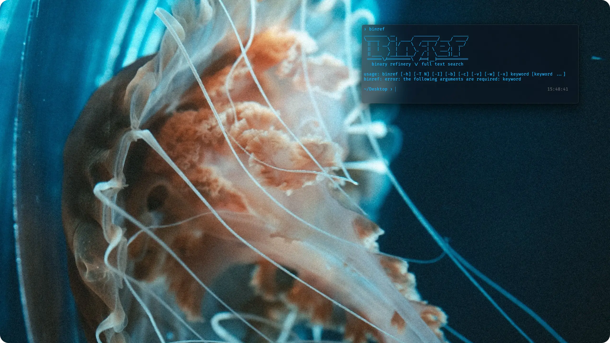

# Bluekit

Bluekit is a cybersecurity-focused workstation setup script that aims to provide a well-rounded and complete analysis environment. 

Bluekit is centered around the [Scoop](https://scoop.sh/) package manager and is complemented by the [Malware Analysis bucket](https://github.com/Donaldduck8/malware-analysis-bucket).

The full list of tools is available [here](https://github.com/Donaldduck8/bluekit/blob/master/data.py).

<p align="center">
  
</p>

## Requirements

> [!CAUTION]
> Bluekit should not be installed on a physical machine. It is designed to run on a clean virtual machine.

* Windows 10 / 11
* PowerShell (64-bit and 32-bit)
* Disk capacity > 30 GB
* Memory > 2GB
* Internet connection
* Windows Defender disabled or removed

> [!IMPORTANT]
> It is strongly recommended to create a Windows ISO with Defender removed, rather than attempting to disable Defender on a running Windows installation.
>
> If you must disable Windows Defender after installation, [here](https://lazyadmin.nl/win-11/turn-off-windows-defender-windows-11-permanently/) is a guide to achieve permanent results.

## Installer

<p align="center">
  
</p>

> [!TIP]
> Bluekit provides a GUI-based installer that allows for rudimentary edits of the configuration, as well as visually responsive progress updates.

<p align="center">
  
</p>

## Usage

Bluekit supports the following command-line arguments:

- `--silent`: Execute the installer without a GUI.
- `--config <path>`: Provide the installer with a custom configuration.
- `--keep-cache`: Do not delete Scoop cache files.

## Bundled Files

Bluekit supports bundling files alongside the installer in a file named `bluekit_bundled.zip`. In order to install licensed applications, a bundle can be constructed like so:

```
╭──────────────────────╮                  ╭───────────────────────────────────╮
│• bluekit.exe         │         ╭────────┤• x64dbg#2024─04─11_18─47[...].zip │
╰──────────────────────╯         │        ╰───────────────────────────────────╯
╭──────────────────────╮         │        ╭───────────────────────────────────╮
│• bluekit_bundled.zip │         ├────────┤• sysinternals#2024.2.13[...].zip  │
╰─●────────────────────╯         │        ╰───────────────────────────────────╯
  │   ╭──────────────────────╮   │                                             
  ├───│• ida_pro.zip         │   │                         ...                 
  │   ╰──────────────────────╯   │                                             
  │   ╭──────────────────────╮   │                                             
  ├───│• ida_pro.json        │   │                                             
  │   ╰──────────────────────╯   │                                             
  │   ╭──────────────────────╮   │                                             
  ╰───│• scoop_cache.zip     ●───╯                                             
      ╰──────────────────────╯                                                 
```

Bundled applications are configured through `<app_name>.json` entries in the Bluekit configuration. Be sure to include a [valid Scoop manifest](https://github.com/Donaldduck8/malware-analysis-bucket/blob/master/bucket/malcat.json) `.json` file alongside your portable application.

It's recommended to pair them with an alternative free application as part of a `one_of` entry. See [the standard configuration](https://github.com/Donaldduck8/bluekit/blob/master/example_custom_configuration.json#L187) for an example.

In order to accelerate multiple installations of Bluekit, you can provide a file named ``scoop_cache.zip`` as part of the bundle. This file will allow Scoop to avoid downloading the same programs repeatedly. This file can be created by installing Bluekit with the `--keep-cache` argument and zipping up the contents of the `%USERPROFILE%\scoop\cache` folder afterwards.


## Contributing

You can improve Bluekit by suggesting or adding new manifests to the Malware Analysis bucket! 💙

## Credits

Jellyfish photography by [@Yuki910828](https://twitter.com/Yuki910828), [@aquarium_sora](https://twitter.com/aquarium_sora) and [@haskap1017](https://twitter.com/haskap1017). 📷
